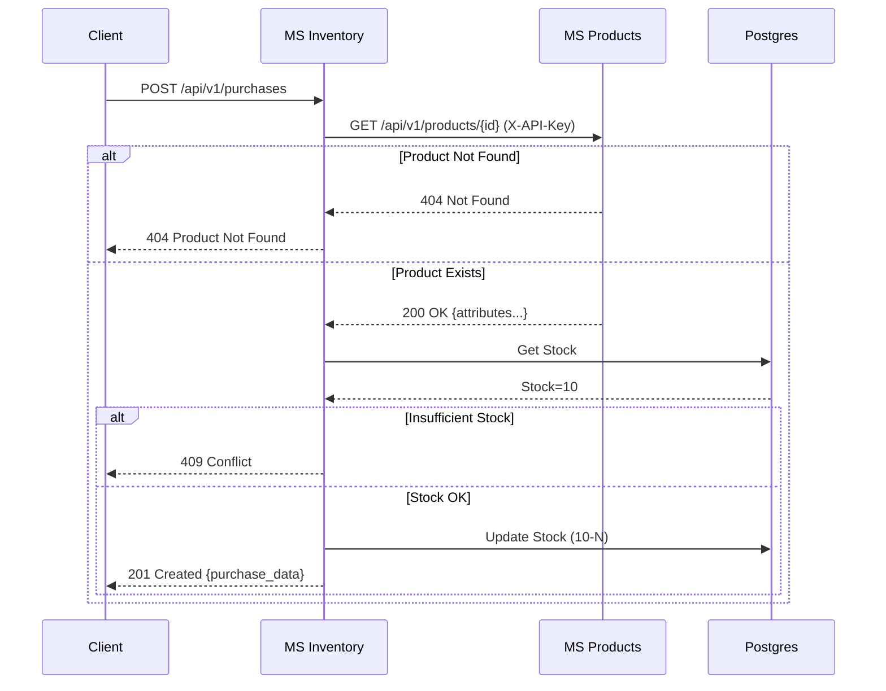

# Sistema de Inventario y Productos (Microservicios)

Este proyecto implementa dos microservicios independientes (`ms-products` y `ms-inventory`) utilizando Java, Spring Boot y Arquitectura Hexagonal, comunicándose vía HTTP con especificación JSON:API.

## Arquitectura

Se sigue estrictamente la **Arquitectura Hexagonal (Ports & Adapters)** para desacoplar el dominio de la infraestructura.

### Estructura de Paquetes
```
com.linktic.<service>
├── application
│   ├── dto           # Data Transfer Objects (Request/Response)
│   ├── mapper        # Mappers DTO <-> Domain
│   └── usecase       # Implementación de Casos de Uso
├── domain
│   ├── exception     # Excepciones de dominio
│   ├── model         # Entidades de dominio (Puras)
│   └── port
│       ├── in        # Puertos de entrada (Interfaces de Casos de Uso)
│       └── out       # Puertos de salida (Interfaces de Repositories/Clientes)
├── infrastructure
│   ├── adapter
│   │   ├── config    # Configuración (OpenAPI, Security, Exceptions)
│   │   ├── in        # Adaptadores de entrada (Rest Controllers)
│   │   └── out       # Adaptadores de salida (JPA Repositories, Rest Clients)
│   └── <Application> # Main Class
```

## Flujo de Trabajo Git Flow (Simulación)

Este proyecto incluye una configuración automatizada para simular y demostrar un flujo de trabajo **Git Flow** completo.

### Estructura de Ramas
- **main**: Producción (Releases estables, tags vX.Y.Z).
- **dev**: Integración Continua (Rama base para desarrollo).
- **feature/**: Nuevas funcionalidades (ej. `feature/endpoint_20260119_1`).
- **fix/**, **hotfix/**, **doc/**, **test/**: Tipos de ramas de soporte.

### Script de Simulación
El script `simulate_gitflow.sh` permite generar un historial de commits simulado que demuestra:
1.  Creación de ramas `feature` desde `dev`.
2.  Commits con fechas históricas (simulando días de trabajo).
3.  Merges a `dev` (Pull Requests simulados).
4.  Release final a `main` con Tag semántico (`v1.0.0`).

**Para ejecutar la simulación:**
```bash
./simulate_gitflow.sh
```

El script generará archivos de simulación en `services/ms-products/src/main/java/com/linktic/msproducts/simulation/`.

## Ejecución

### Requisitos
- Docker y Docker Compose
- Java 21 (para desarrollo local)
- Maven (incluido wrapper o local)

### Pasos
1. **Compilar y construir imágenes Docker**:
   ```bash
   docker-compose build
   ```
   (O compilar primero con Maven: `mvn clean package`)

2. **Levantar el sistema**:
   ```bash
   docker-compose up -d
   ```

3. **Verificar servicios**:
   - **API Gateway**: http://localhost:8080
   - **Products Service**: http://localhost:8081/actuator/health
   - **Inventory Service**: http://localhost:8082/actuator/health
   - **Swagger Products**: http://localhost:8081/swagger-ui/index.html
   - **Swagger Inventory**: http://localhost:8082/swagger-ui/index.html

   Acceso vía gateway (recomendado para la demo):
   - Landing: http://localhost:8080/
   - **Swagger Products**: http://localhost:8080/products/swagger-ui/index.html
   - **Swagger Inventory**: http://localhost:8080/inventory/swagger-ui/index.html
   - **Health Products**: http://localhost:8080/products/actuator/health
   - **Health Inventory**: http://localhost:8080/inventory/actuator/health

### Seguridad y Pruebas
- **JWT Authentication**: El sistema utiliza JSON Web Tokens (JWT) para la autenticación.
- **Obtención de Token**:
  1. Realizar una petición `POST` a `/api/v1/auth/authenticate` (vía Gateway) o `/api/v1/auth/authenticate` (directo a ms-products).
  2. Body:
     ```json
     {
       "username": "admin",
       "password": "password"
     }
     ```
  3. La respuesta incluirá un `token`.

- **Uso del Token**:
  - Incluir el header `Authorization: Bearer <token>` en todas las peticiones a endpoints protegidos.

- **Swagger UI**:
  1. Abrir Swagger (ej. http://localhost:8080/products/swagger-ui/index.html).
  2. Hacer clic en el botón verde **Authorize** (arriba a la derecha).
  3. Ingresar el valor del token JWT (sin el prefijo "Bearer ", Swagger lo suele añadir o especificar si se requiere). *Nota: En esta configuración, ingresa solo el token.*
  4. Clic en **Authorize** y luego **Close**.
  5. Ahora todos los requests "Try it out" enviarán automáticamente el header.

### Endpoints Principales
   - **Products API**: http://localhost:8080/api/v1/products
   - **Inventory API**: http://localhost:8080/api/v1/inventory/{productId}
   - **Purchases API**: http://localhost:8080/api/v1/purchases

## Análisis de Código y Cobertura (SonarQube)

El proyecto incluye configuración para análisis de calidad de código con SonarQube y cobertura con JaCoCo.

### Pre-requisitos
El servicio de SonarQube se inicia automáticamente con `docker-compose`.
- **URL**: http://localhost:9000
- **Credenciales por defecto**: admin / admin (se pedirá cambiar en el primer login)

### Paso a Paso para Validar en SonarQube

1. **Acceder a SonarQube**:
   - Ingresa a [http://localhost:9000](http://localhost:9000).
   - Loguéate con `admin` / `admin`.
   - Sigue los pasos para cambiar la contraseña (ej. usa `admin123` para pruebas locales).

2. **Generar Token de Acceso**:
   - Una vez logueado, ve a tu perfil (icono arriba a la derecha) -> **My Account**.
   - Ve a la pestaña **Security**.
   - En la sección **Generate Tokens**, pon un nombre (ej. `maven-analysis`) y selecciona "Global Analysis Token" o "User Token".
   - Haz clic en **Generate** y copia el token generado (ej. `sqp_xyz...`).

3. **Ejecutar el Análisis**:
   - Asegúrate de tener Java 21 y Maven configurados.
   - Ejecuta los siguientes comandos reemplazando `TU_TOKEN` por el que acabas de copiar.

   **Para ms-products:**
   ```bash
   cd services/ms-products
   mvn clean verify sonar:sonar -Dsonar.token=TU_TOKEN
   ```

   **Para ms-inventory:**
   ```bash
   cd services/ms-inventory
   mvn clean verify sonar:sonar -Dsonar.token=TU_TOKEN
   ```

4. **Ver Resultados**:
   - Actualiza la página de proyectos en SonarQube.
   - Verás `ms-products` y `ms-inventory` con sus métricas de calidad, bugs, vulnerabilidades y cobertura de pruebas.

### Configuración
- **Cobertura**: Se utiliza `jacoco-maven-plugin`. El reporte se genera en `target/site/jacoco/index.html`.
- **Exclusiones**: Se han excluido del análisis de cobertura las clases de configuración, DTOs, Mappers, Excepciones y Entidades, enfocándose en la lógica de dominio y casos de uso.

## Decisiones Técnicas

1. **Base de Datos**: Se utiliza **PostgreSQL** ejecutado en Docker. Se eligió por robustez y consistencia de datos. Cada microservicio tiene su propio esquema/base de datos lógica (`products_db`, `inventory_db`) aunque comparten instancia por simplicidad en docker-compose.
2. **Comunicación**: HTTP síncrono utilizando `RestClient` (Spring 6). Se implementó un mecanismo de **Retry** (2 intentos) y **Timeout** (2s) para resiliencia en la llamada de Inventario a Productos.
3. **Seguridad**: Autenticación simple mediante **API Key** (`X-API-Key`) configurada en variables de entorno.
4. **Endpoint de Compra en Inventario**: Se ubicó en el microservicio de Inventario porque es la "Fuente de Verdad" del stock. La compra es una operación que modifica principalmente el estado del inventario (resta stock). Validar el producto es una pre-condición. Esto respeta el principio de **Single Responsibility**.
5. **API Gateway**: Se incluye un gateway liviano (Nginx) para enrutar `/products/*` hacia `ms-products` y `/inventory/*` hacia `ms-inventory`, manteniendo los microservicios independientes y aplicando el header `X-API-Key` de extremo a extremo.

## Flujo de Compra

1. **Cliente** envía `POST /api/v1/purchases` a `ms-inventory`.
2. **Inventory Controller** recibe DTO y llama a `PurchaseUseCase`.
3. **PurchaseUseCase**:
   - Llama a `ProductClientPort` para verificar existencia del producto en `ms-products`.
     - `ms-inventory` -> HTTP GET -> `ms-products`.
     - Si falla (timeout/5xx), reintenta. Si 404, lanza `ProductNotFoundException`.
   - Consulta `InventoryRepositoryPort` para obtener stock actual.
   - Valida si `stock >= cantidad`. Si no, lanza `InsufficientStockException`.
   - Descuenta stock y guarda en BD (`save`).
   - Retorna objeto `Purchase`.
4. **Controller** retorna respuesta JSON:API 201 Created.

## Diagrama de Interacción (Mermaid)



## Uso de IA

Se utilizó un asistente de IA como **herramienta de apoyo y copiloto** durante el desarrollo, desempeñando los siguientes roles:

- **Sugerencias de Código**: Apoyo en la implementación de patrones y snippets específicos.
- **Verificación de Código Limpio**: Revisión de estilo y buenas prácticas (Clean Code).
- **Diseño de Arquitectura**: Asistencia en la generación y visualización de diagramas y propuestas de arquitectura (Hexagonal).
- **Validación de Infraestructura**: Verificación de la correcta creación y configuración de los contenedores Docker y orquestación con Docker Compose.

**Nota**: Las decisiones finales de arquitectura y lógica de negocio fueron tomadas y validadas por el desarrollador.
