# Sistema de Inventario y Productos (Microservicios)

Este proyecto implementa dos microservicios independientes (`ms-products` y `ms-inventory`) utilizando Java, Spring Boot y Arquitectura Hexagonal, comunicándose vía HTTP con especificación JSON:API.

## Arquitectura

Se sigue estrictamente la **Arquitectura Hexagonal (Ports & Adapters)** para desacoplar el dominio de la infraestructura.

### Estructura de Paquetes
```
com.linktic.<service>
├── application
│   ├── dto           # Data Transfer Objects (Request/Response)
│   ├── mapper        # Mappers DTO <-> Domain
│   └── usecase       # Implementación de Casos de Uso
├── domain
│   ├── exception     # Excepciones de dominio
│   ├── model         # Entidades de dominio (Puras)
│   └── port
│       ├── in        # Puertos de entrada (Interfaces de Casos de Uso)
│       └── out       # Puertos de salida (Interfaces de Repositories/Clientes)
├── infrastructure
│   ├── adapter
│   │   ├── config    # Configuración (OpenAPI, Security, Exceptions)
│   │   ├── in        # Adaptadores de entrada (Rest Controllers)
│   │   └── out       # Adaptadores de salida (JPA Repositories, Rest Clients)
│   └── <Application> # Main Class
```

## Ejecución

### Requisitos
- Docker y Docker Compose
- Java 21 (para desarrollo local)
- Maven (incluido wrapper o local)

### Pasos
1. **Compilar y construir imágenes Docker**:
   ```bash
   docker-compose build
   ```
   (O compilar primero con Maven: `mvn clean package`)

2. **Levantar el sistema**:
   ```bash
   docker-compose up -d
   ```

3. **Verificar servicios**:
   - **API Gateway**: http://localhost:8080
   - **Products Service**: http://localhost:8081/actuator/health
   - **Inventory Service**: http://localhost:8082/actuator/health
   - **Swagger Products**: http://localhost:8081/swagger-ui/index.html
   - **Swagger Inventory**: http://localhost:8082/swagger-ui/index.html

   Acceso vía gateway (recomendado para la demo):
   - Landing: http://localhost:8080/
   - **Swagger Products**: http://localhost:8080/products/swagger-ui/index.html
   - **Swagger Inventory**: http://localhost:8080/inventory/swagger-ui/index.html
   - **Health Products**: http://localhost:8080/products/actuator/health
   - **Health Inventory**: http://localhost:8080/inventory/actuator/health

### Seguridad y Pruebas
- **API Key Authentication**: El sistema utiliza API Keys para la autenticación entre servicios y clientes autorizados.
- **Configuración**:
  - La API Key se configura mediante la variable de entorno `API_KEY` (o en `application.yml`).
  - Valor por defecto (dev): `inventory-microservices-api-key-12345`

- **Uso de la API Key**:
  - Incluir el header `X-API-Key: <api-key>` en todas las peticiones a endpoints protegidos.

- **Swagger UI**:
  1. Abrir Swagger (ej. http://localhost:8080/products/swagger-ui/index.html).
  2. Hacer clic en el botón verde **Authorize** (arriba a la derecha).
  3. Ingresar el valor de la API Key (ej. `inventory-microservices-api-key-12345`).
  4. Clic en **Authorize** y luego **Close**.
  5. Ahora todos los requests "Try it out" enviarán automáticamente el header.

### Endpoints Principales
   - **Products API**: http://localhost:8080/api/v1/products
   - **Inventory API**: http://localhost:8080/api/v1/inventory/{productId}
   - **Purchases API**: http://localhost:8080/api/v1/purchases

## Análisis de Código y Cobertura (SonarQube)

El proyecto incluye configuración para análisis de calidad de código con SonarQube y cobertura con JaCoCo.

### Pre-requisitos
El servicio de SonarQube se inicia automáticamente con `docker-compose`.
- **URL**: http://localhost:9000
- **Credenciales por defecto**: admin / admin (se pedirá cambiar en el primer login)

### Paso a Paso para Validar en SonarQube

1. **Acceder a SonarQube**:
   - Ingresa a [http://localhost:9000](http://localhost:9000).
   - Loguéate con `admin` / `admin`.
   - Sigue los pasos para cambiar la contraseña (ej. usa `admin123` para pruebas locales).

2. **Generar Token de Acceso**:
   - Una vez logueado, ve a tu perfil (icono arriba a la derecha) -> **My Account**.
   - Ve a la pestaña **Security**.
   - En la sección **Generate Tokens**, pon un nombre (ej. `maven-analysis`) y selecciona "Global Analysis Token" o "User Token".
   - Haz clic en **Generate** y copia el token generado (ej. `sqp_xyz...`).

3. **Ejecutar el Análisis**:
   - Asegúrate de tener Java 21 y Maven configurados.
   - Ejecuta los siguientes comandos reemplazando `TU_TOKEN` por el que acabas de copiar.

   **Para ms-products:**
   ```bash
   cd services/ms-products
   mvn clean verify sonar:sonar -Dsonar.token=TU_TOKEN
   ```

   **Para ms-inventory:**
   ```bash
   cd services/ms-inventory
   mvn clean verify sonar:sonar -Dsonar.token=TU_TOKEN
   ```

4. **Ver Resultados**:
   - Actualiza la página de proyectos en SonarQube.
   - Verás `ms-products` y `ms-inventory` con sus métricas de calidad, bugs, vulnerabilidades y cobertura de pruebas.

### Configuración
- **Cobertura**: Se utiliza `jacoco-maven-plugin`. El reporte se genera en `target/site/jacoco/index.html`.
- **Exclusiones**: Se han excluido del análisis de cobertura las clases de configuración, DTOs, Mappers, Excepciones y Entidades, enfocándose en la lógica de dominio y casos de uso.

## Decisiones Técnicas

1. **Base de Datos**: Se utiliza **PostgreSQL** ejecutado en Docker. Se eligió por robustez y consistencia de datos. Cada microservicio tiene su propio esquema/base de datos lógica (`products_db`, `inventory_db`) aunque comparten instancia por simplicidad en docker-compose.
2. **Comunicación**: HTTP síncrono utilizando `RestClient` (Spring 6). Se implementó un mecanismo de **Retry** (2 intentos) y **Timeout** (2s) para resiliencia en la llamada de Inventario a Productos.
3. **Seguridad**: Autenticación mediante **API Key**. Se requiere el header `X-API-Key` con un valor válido para acceder a los endpoints protegidos.
4. **Endpoint de Compra en Inventario**: Se ubicó en el microservicio de Inventario porque es la "Fuente de Verdad" del stock. La compra es una operación que modifica principalmente el estado del inventario (resta stock). Validar el producto es una pre-condición. Esto respeta el principio de **Single Responsibility**.
5. **Historial y Eventos**: Se implementó un registro de auditoría de compras y un sistema de eventos de dominio (`InventoryChangedEvent`) para desacoplar la lógica de actualización de stock de otras posibles reacciones futuras (notificaciones, reportes, etc.).
6. **API Gateway**: Se incluye un gateway liviano (Nginx) para enrutar `/products/*` hacia `ms-products` y `/inventory/*` hacia `ms-inventory`, manteniendo los microservicios independientes.

## Diagrama de Arquitectura

A continuación se presenta la arquitectura lógica del sistema desplegado, mostrando la separación de capas (Pública, Privada, Datos) y los componentes principales.

```mermaid
graph TD
    %% Estilos
    classDef user fill:#0d47a1,stroke:#000,stroke-width:2px,color:#fff;
    classDef public fill:#e3f2fd,stroke:#1565c0,stroke-width:2px,stroke-dasharray: 5 5;
    classDef private fill:#fff3e0,stroke:#e65100,stroke-width:2px;
    classDef data fill:#e8f5e9,stroke:#2e7d32,stroke-width:2px;
    classDef ext fill:#f3e5f5,stroke:#7b1fa2,stroke-width:2px;

    User((Usuario / Cliente)):::user

    subgraph "Docker Host / Cluster"
        
        subgraph "Capa Pública (Acceso)"
            Nginx[("🦁 Nginx Gateway<br/>(Load Balancer & Routing)<br/>Port: 8080")]:::public
        end

        subgraph "Capa Privada (Aplicación)"
            subgraph "ms-products"
                ProdService["📦 Product Service<br/>(Spring Boot 3)"]:::private
                ProdSec["🔐 API Key Filter"]:::private
            end

            subgraph "ms-inventory"
                InvService["📝 Inventory Service<br/>(Spring Boot 3)"]:::private
                InvSec["🔐 API Key Filter"]:::private
            end
        end

        subgraph "Capa de Datos (Persistencia)"
            Postgres[("🐘 PostgreSQL<br/>(Single Instance)")]:::data
            DB1[("Products DB")]:::data
            DB2[("Inventory DB")]:::data
        end
    end

    subgraph "CI/CD & Source"
        Git["🐙 GitHub<br/>(Repo)"]:::ext
        Maven["🛠️ Maven<br/>(Build & Test)"]:::ext
    end

    %% Conexiones
    User -->|HTTP JSON:API<br/>X-API-Key| Nginx
    
    Nginx -->|"/products/*"| ProdService
    Nginx -->|"/inventory/*"| InvService
    Nginx -->|"/purchases"| InvService

    %% Comunicación entre microservicios
    InvService -->|"HTTP Sync Client<br/>(Validar Producto)"| ProdService

    %% Conexiones a BD
    ProdService -->|JPA/Hibernate| DB1
    InvService -->|JPA/Hibernate| DB2
    
    DB1 -.-> Postgres
    DB2 -.-> Postgres

    %% CI/CD Flow
    Git -.-> Maven
    Maven -.->|"Build Image"| ProdService
    Maven -.->|"Build Image"| InvService

```



## Flujo de Compra

1. **Cliente** envía `POST /api/v1/purchases` a `ms-inventory`.
2. **Inventory Controller** recibe DTO y llama a `PurchaseUseCase`.
3. **PurchaseUseCase**:
   - Llama a `ProductClientPort` para verificar existencia del producto en `ms-products`.
     - `ms-inventory` -> HTTP GET -> `ms-products`.
     - Si falla (timeout/5xx), reintenta. Si 404, lanza `ProductNotFoundException`.
   - Consulta `InventoryRepositoryPort` para obtener stock actual.
   - Valida si `stock >= cantidad`. Si no, lanza `InsufficientStockException`.
   - Descuenta stock y guarda en BD (`save`).
   - Retorna objeto `Purchase`.
4. **Controller** retorna respuesta JSON:API 201 Created.

## Diagrama de Interacción (Mermaid)


## Mejoras Futuras y Escalabilidad

Para llevar este sistema a un entorno de producción de alta escala, se proponen las siguientes mejoras:

1.  **Seguridad Avanzada (OAuth2/OIDC + JWT)**:
    - Migrar de API Keys a un flujo estándar de OAuth2 con JWT. Esto permite una gestión de identidad centralizada (Keycloak/Auth0), scopes granulares y mejor seguridad para clientes públicos (SPA/Mobile).

2.  **Comunicación Asíncrona (Event-Driven Architecture)**:
    - Reemplazar la comunicación síncrona actual (o complementarla) con un Broker de Mensajes como **RabbitMQ** o **Kafka**.
    - Ejemplo: Al crear una compra, publicar un evento `PurchaseCreated` en una cola. Servicios de Facturación, Notificaciones o Analytics pueden consumir este evento sin afectar la latencia del usuario.

3.  **Resiliencia y Tolerancia a Fallos**:
    - Implementar **Circuit Breakers** (Resilience4j) más robustos para evitar fallos en cascada cuando un microservicio dependiente está caído.
    - Añadir **Rate Limiting** en el Gateway para proteger el sistema de picos de tráfico.

4.  **Observabilidad Distribuida**:
    - Integrar **OpenTelemetry** con herramientas como Zipkin o Jaeger para visualizar la traza completa de una petición a través de todos los microservicios, complementando los logs actuales con MDC.

5.  **Caché Distribuido (Redis)**:
    - Implementar una capa de caché para datos de lectura frecuente y baja mutabilidad (como el catálogo de productos) para reducir la carga en la base de datos.

6.  **Orquestación y Configuración**:
    - Migrar de Docker Compose a **Kubernetes (K8s)** para auto-escalado, self-healing y gestión de despliegues.
    - Utilizar **Spring Cloud Config** o **Consul** para externalizar y centralizar la configuración de todos los microservicios.

## Uso de IA

Se utilizó un asistente de IA como **herramienta de apoyo y copiloto** durante el desarrollo, desempeñando los siguientes roles:

- **Sugerencias de Código**: Apoyo en la implementación de patrones y snippets específicos.
- **Verificación de Código Limpio**: Revisión de estilo y buenas prácticas (Clean Code).
- **Diseño de Arquitectura**: Asistencia en la generación y visualización de diagramas y propuestas de arquitectura (Hexagonal).
- **Validación de Infraestructura**: Verificación de la correcta creación y configuración de los contenedores Docker y orquestación con Docker Compose.

**Nota**: Las decisiones finales de arquitectura y lógica de negocio fueron tomadas y validadas por el desarrollador.
